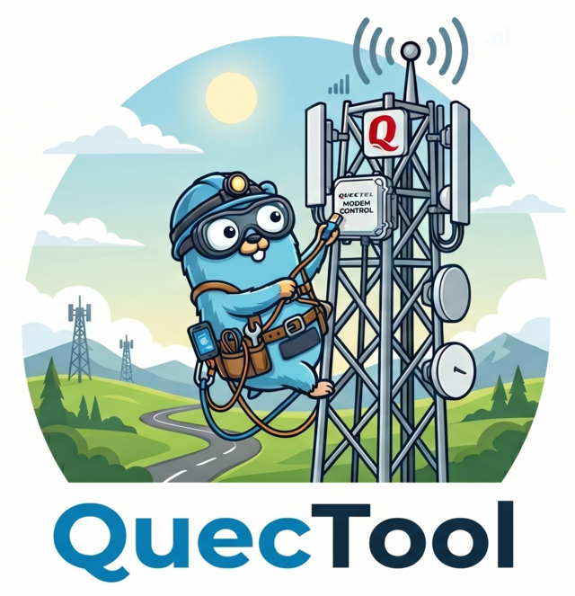

<p align="center">
  
</p>

<p align="center">
  <b>A web UI and HTTP API for managing Quectel cellular modems.</b>
</p>

---

QuecTool is a small Go server that talks AT commands to a Quectel modem and serves a React frontend for everything you'd otherwise be doing in a terminal: checking signal, locking bands and cells, scanning operators, reading SMS, watching the connection come up.

It's built to run *on* the modem-host (M.2 carrier board, router, SBC) and stay out of the way. Single static binary, embedded UI, no external dependencies.

## Features

- **Live dashboard** — signal strength (RSRP/RSRQ/SINR), connection state, serving cell, carrier-aggregation legs, modem-assigned IP/gateway/DNS, host network interfaces.
- **Network workbench** — operator scan, full RF cell survey, lock to current cell or a specific band/PCI/ARFCN, manual cell-lock form, raw QENG/QCAINFO output.
- **Settings** — APN, network mode (LTE / NR5G-NSA / NR5G-SA / Auto), LTE & NR5G band masks, USB-vs-PCIe data path, with auto `CFUN=1,1` cycle on save.
- **SMS** — list, read, send, bulk-delete, mark-all-read.
- **AT console** — one-shot AT command runner and a streaming serial console over websocket.
- **Embedded SSH server** — log into a shell on the device using the same credentials as the web UI.
- **Modem abstraction** — first-class support for the Quectel RM520N-GL / RM521F-GL family; a `generic` driver for everything else.

## Supported modems

- Quectel **RM520N-GL** / **RM521F-GL** (full feature set: NR5G-SA, band locking, cell survey, carrier aggregation reporting)
- Anything that speaks standard 3GPP AT commands via the **generic** driver (signal, cell info, SMS, basic settings)

Adding a new modem is a matter of dropping a package under `quectool/modem/` and registering a constructor — see `quectool/modem/rm520/` as the reference implementation.

## Install on a Quectel modem

Prerequisites: `adb` reachable to the modem, with a root shell (the modem rootfs is read-only by default; the installer remounts it rw, drops files, remounts ro).

**Linux / macOS (or WSL / Git Bash on Windows):**

```bash
curl -L https://raw.githubusercontent.com/snowzach/quectool/main/deploy.sh -o deploy.sh
chmod +x deploy.sh
./deploy.sh                                    # install latest GitHub release
./deploy.sh v2.0.0                             # install a specific tag
./deploy.sh ./quectool-v2.0.0-armv7.tar.gz     # install a local tarball
```

**Windows (PowerShell):**

```powershell
Invoke-WebRequest https://raw.githubusercontent.com/snowzach/quectool/main/deploy.ps1 -OutFile deploy.ps1
.\deploy.ps1                                       # latest GitHub release
.\deploy.ps1 v2.0.0                                # specific tag
.\deploy.ps1 .\quectool-v2.0.0-armv7.tar.gz        # local tarball
```

`deploy.sh` downloads the release tarball, verifies its SHA-256, pushes it via adb, and runs the on-device installer. The installer drops the binary at `/usrdata/quectool/quectool`, the config at `/usrdata/quectool/quectool.yaml`, and a systemd unit at `/lib/systemd/system/quectool.service`. After install, browse to `https://<modem-ip>` — a self-signed cert is auto-generated on first boot covering every interface IP. Browsers warn the first time per device; trust once and it sticks.

Default credentials are `admin` / `quectool`. After logging in, click your username in the top-right to open the **Account** page and change the password. The new bcrypt hash is written to `/usrdata/quectool/credentials` (and that file always wins over whatever's in `quectool.yaml`). Forgotten password recovery: `adb shell rm /usrdata/quectool/credentials && adb shell systemctl restart quectool` resets to the bootstrap defaults.

Re-running `deploy.sh` is the upgrade path: the existing config and credentials are preserved; the new YAML defaults are written next to it as `quectool.yaml.new` for review.

<details>
<summary>Manual install (no deploy script — works on any OS with adb)</summary>

The on-device installer is the only thing that has to run on a particular shell (busybox on the modem). The host-side commands are just `adb push` + `adb shell` — they work the same in bash, zsh, cmd.exe, or PowerShell. Download a tarball + `.sha256` from <https://github.com/snowzach/quectool/releases>, then:

```
adb push quectool-v2.0.0-armv7.tar.gz /tmp/q.tar.gz
adb shell "set -e; cd /tmp && rm -rf q && mkdir q && cd q && tar xzf ../q.tar.gz && sh install.sh"
```

Uninstall: `adb shell "sh /usrdata/quectool/uninstall.sh"` (add `--purge` to also wipe `/usrdata/quectool/`).

</details>

## Configuration

The release tarball ships [`dist/quectool.yaml`](dist/quectool.yaml) — a YAML file with every knob commented. Edit on the modem:

```bash
adb shell vi /usrdata/quectool/quectool.yaml
adb shell systemctl restart quectool
adb shell journalctl -u quectool -f
```

Any value can also be overridden by an environment variable: dots become underscores, name uppercased. `server.port` → `SERVER_PORT`. `modem.port` → `MODEM_PORT`. Run `./quectool server --help` for the full list.

## TLS

HTTPS is the default. On first boot the binary writes a 10-year self-signed cert + key to `server.certfile` and `server.keyfile` (defaulting to `/usrdata/quectool/server.{crt,key}`), with SAN entries for every UP interface IP plus loopback names. Browsers warn the first time per device; trust once and it sticks.

To regenerate after a network reconfiguration (modem moved to a new LAN, picked up a new IP):

```bash
adb shell rm /usrdata/quectool/server.crt /usrdata/quectool/server.key
adb shell systemctl restart quectool
# or, without restarting:
adb shell /usrdata/quectool/quectool gencert \
  --cert /usrdata/quectool/server.crt \
  --key  /usrdata/quectool/server.key \
  --force
```

To use a real cert (your CA, internal PKI, etc.), drop the PEM files at the configured paths and restart. To run plain HTTP, set `server.tls: false` in `quectool.yaml` and pick a non-privileged port.

## API

All endpoints under `/api/` require session authentication (`POST /api/auth/login` with JSON `{"username","password"}` to obtain a cookie). The UI is just a consumer of these.

| Path | Purpose |
|---|---|
| `POST /api/auth/login` | Issues a session cookie + token |
| `POST /api/auth/logout` | Invalidates the current session |
| `POST /api/auth/passwd` | Rotate password (writes credentials file) |
| `GET  /api/auth/whoami` | Current session info |
| `GET  /api/dashboard` | Aggregated home-page payload (signal + sim + cell + sysinfo) |
| `GET  /api/modem/info` | Modem identity + capabilities + available bands |
| `GET  /api/modem/signal` | Live RSRP/RSRQ/SINR + QENG state |
| `GET  /api/modem/cell` | Serving cell + secondary CA cells |
| `GET  /api/modem/sim` | SIM, registration, APN, modem-assigned IPs/DNS |
| `GET  /api/modem/settings` | APN, network mode, band masks, cell-lock |
| `PUT  /api/modem/settings` | Partial update (any subset of groups) |
| `POST /api/modem/scan` | Operator scan (`AT+COPS=?`) |
| `POST /api/modem/cell-survey` | Full RF sweep (`AT+QSCAN=3,1`) — slow, 30–90 s |
| `POST /api/modem/cell-lock` | Lock to current or specified cell |
| `POST /api/modem/reboot` | Modem reset (`CFUN=1,1`) |
| `POST /api/modem/data-path` | Switch USB ↔ PCIe data plane (next reboot) |
| `GET/POST/DELETE /api/modem/sms*` | List / send / delete / mark-read |
| `GET  /api/atcmd?cmd=…` | One-shot AT passthrough |
| `GET  /api/sysinfo` | Host uptime, load, interfaces |
| `WS   /api/terminal` | Streaming shell over websocket |
| `/debug/pprof/*` | Go pprof endpoints (auth-gated) |

URL-encode AT command arguments. Example:

```
GET /api/atcmd?cmd=AT%2BCGMM%3B%2BQGMR%3B%2BCGCONTRDP%3D1
{
  "status": "OK",
  "response": ["RM521F-GL", "RM521FGLEAR05A02M4G_01.200.01.200", "+CGCONTRDP: 1,4,…"]
}
```

## Local development

QuecTool talks AT to whatever serial device `modem.port` (or `MODEM_PORT`) points at. With a Quectel module attached over USB to your workstation, the AT port enumerates as `/dev/ttyUSB2` or `/dev/ttyUSB3` (varies by module + carrier). Identify it:

```bash
ls -l /dev/serial/by-id/   # stable names; look for "Quectel"
dmesg | grep ttyUSB        # right after plugging in
```

Two-terminal workflow:

```bash
# Terminal 1 — backend, hot-reloads on save, frontend served from disk:
make dev-backend
# (override port if needed:  MODEM_PORT=/dev/ttyUSB2 make dev-backend)

# Terminal 2 — Vite dev server (proxies /api → :8080):
make dev-frontend

# Browse to http://localhost:5173/
```

Other useful targets:

```bash
make types       # regenerate frontend/src/types/ from Go structs (tygo)
make test        # go test -cover ./...
cd frontend && npm install && npm test    # frontend tests
```

The frontend is React + TypeScript + Tailwind, built with Vite, embedded into the Go binary at compile time. TypeScript types under `frontend/src/types/` are generated from Go structs by [tygo](https://github.com/gzuidhof/tygo) — never edit them by hand.

Architecture notes:

- `cmd/` — cobra commands (`server`, `atcmd`, `passwd` for one-shot bcrypt, `gencert` for one-shot cert generation)
- `quectool/atserver/` — serial port owner; serializes AT commands across HTTP handlers
- `quectool/modem/` — modem abstraction + per-model drivers (RM520, generic)
- `quectool/mainrpc/` — chi router, all `/api` handlers
- `quectool/auth/`, `quectool/credfile/`, `quectool/tlsgen/` — credential verifier, htpasswd-style overrides file, self-signed cert generation
- `embed/` — built frontend assets, embedded via `go:embed`
- `frontend/` — Vite + React UI
- `dist/` — release artifacts (config, systemd unit, install/uninstall scripts) bundled into the tarball
- `deploy.sh` — workstation-side one-shot installer over adb

## Cutting a release

Releases are produced by `.github/workflows/release.yml` on tag push:

```bash
git tag v2.0.0
git push --tags
```

The workflow builds the frontend, cross-compiles the armv7 binary, bundles `dist/` into `quectool-<version>-armv7.tar.gz`, and uploads it (with a `.sha256`) to the GitHub Release. To produce the same tarball locally without going through GitHub:

```bash
make release-tar
./deploy.sh ./build/quectool-<version>-armv7.tar.gz
```

## License

See [LICENSE](LICENSE).
